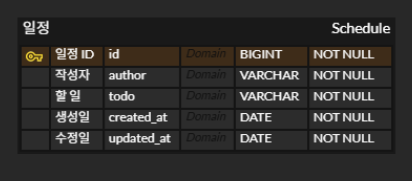
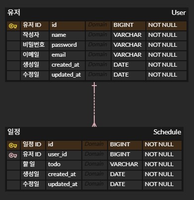

# **카카오테크 캠퍼스 2차 과제**

## **API**

| 기능         | Method   | URL                           |
| ---------- | -------- | ----------------------------- |
| 일정 생성      | `POST`   | `/api/schedules`              |
| 일정 조회 (단건) | `GET`    | `/api/schedules/{scheduleId}` |
| 일정 조회 (전체) | `GET`    | `/api/schedules`              |
| 일정 수정      | `PUT`    | `/api/schedules/{scheduleId}` |
| 일정 삭제      | `DELETE` | `/api/schedules/{scheduleId}` |

## **ERD** 
### LV1~2


### LV3~


---
# **일정 생성**

## **Request**

### Body

| Name    | Type | Mandatory | Description |
|---------| --- | --- |------------|
| todo    | string | ✅ | 할 일        |
| author  | string | ✅ | 작성자        |
| email   | string | ✅ | 이메일        |
| password | string | ✅ | 비밀번호       |

- **JSON**

    ```json
    {
      "todo": "String",
      "author": "String",
      "email": "String",
      "password": "String" 
    }
    ```

## **Response**

### Body

- **JSON**

    ```json
    {	
      "schedule_id": "Long",
      "user_id": "Long",
      "todo": "String",
      "author": "String",
      "email": "String",
      "created_at": "LocalDate",
      "updated_at": "LocalDate"
    }
    ```

## **Status Code**

| Code | Description                |
| ---- | -------------------------- |
| 201  | 일정 생성 성공                   |
| 400  | 잘못된 요청 (필수 값 누락 또는 유효성 오류) |
| 500  | 서버 내부 오류                   |


---
# **일정 조회 (단건)**

## **Request**

### **Path Variable**

| Name | Type | Mandatory | Description |
| --- | --- | --- | --- |
| scheduleId | Long | ✅ | 조회할 일정 ID |

## **Response**

### Body

- **JSON**

    ```json
    {	
      "schedule_id": "Long",
      "user_id": "Long",
      "todo": "String",
      "author": "String",
      "email": "String",
      "created_at": "LocalDate",
      "updated_at": "LocalDate"
    }
    ```

## **Status Code**

| Code | Description        |
| ---- | ------------------ |
| 200  | 일정 조회 성공           |
| 404  | 해당 ID의 일정이 존재하지 않음 |
| 500  | 서버 내부 오류           |

---
# **일정 조회 (조건)**

## **Request**

### Query Parameter

| Name      | Type  | Mandatory | Description          |
|-----------|-------| --- |----------------------|
| updated_at | string | ❌ | 수정일 (형식: YYYY-MM-DD) |
| userId    | Long  | ❌ | 유저 고유 Id             |

→ 두 조건이 모두 들어오지 않을 시 전체를 조회한다.

## Response

### Body

- **JSON**

    ```json
    [
        {	
          "schedule_id": "Long",
          "user_id": "Long",
          "todo": "String",
          "author": "String",
          "email": "String",
          "created_at": "LocalDate",
          "updated_at": "LocalDate"
        },
        {	
          "schedule_id": "Long",
          "user_id": "Long",
          "todo": "String",
          "author": "String",
          "email": "String",
          "created_at": "LocalDate",
          "updated_at": "LocalDate"
        }
    ]
    ```

## **Status Code**

| Code | Description |
| ---- | ----------- |
| 200  | 일정 목록 조회 성공 |
| 500  | 서버 내부 오류    |

---
# **일정 수정**

## **Request**

### **Path Variable**

| Name | Type | Mandatory | Description |
| --- | --- | --- | --- |
| scheduleId | Long | ✅ | 수정할 일정 ID |

### Body

| Name | Type | Mandatory | Description |
| --- | --- | --- |------------|
| todo | string | ✅ | 수정한 할 일    |
| author | string | ✅ | 수정한 작성자    |
| email   | string | ✅ | 이메일        |
| password | string | ✅ | 비밀번호       |

→ 이메일은 수정 불가능하다.

- **JSON**

    ```json
    {
      "todo": "String",
      "author": "String",
      "email": "String",
      "password": "String"
    }
    ```

## **Response**

### Body

- **JSON**

    ```json
    {	
      "schedule_id": "Long",
      "user_id": "Long",
      "todo": "String",
      "author": "String",
      "email": "String",
      "created_at": "LocalDate",
      "updated_at": "LocalDate"
    }
    ```

## **Status Code**

| Code | Description                |
| ---- | -------------------------- |
| 200  | 일정 수정 성공                   |
| 400  | 잘못된 요청 (필수 값 누락 또는 유효성 오류) |
| 403  | 비밀번호 불일치                   |
| 404  | 해당 ID의 일정이 존재하지 않음         |
| 500  | 서버 내부 오류                   |

---
# **일정 삭제**

## **Request**

### **Path Variable**

| Name | Type | Mandatory | Description |
| --- | --- | --- | --- |
| scheduleId | Long | ✅ | 삭제할 일정 ID |

### Query Parameter

| Name | Type | Mandatory | Description |
| --- | --- | --- | --- |
| password | string | ✅ | 비밀번호 |

## **Status Code**
| Code | Description         |
| ---- | ------------------- |
| 204  | 일정 삭제 성공 (응답 본문 없음) |
| 403  | 비밀번호 불일치            |
| 404  | 해당 ID의 일정이 존재하지 않음  |
| 500  | 서버 내부 오류            |
---